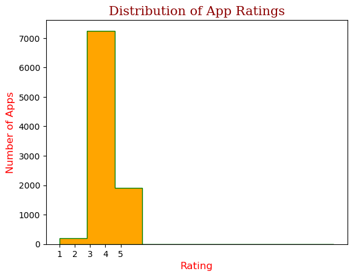
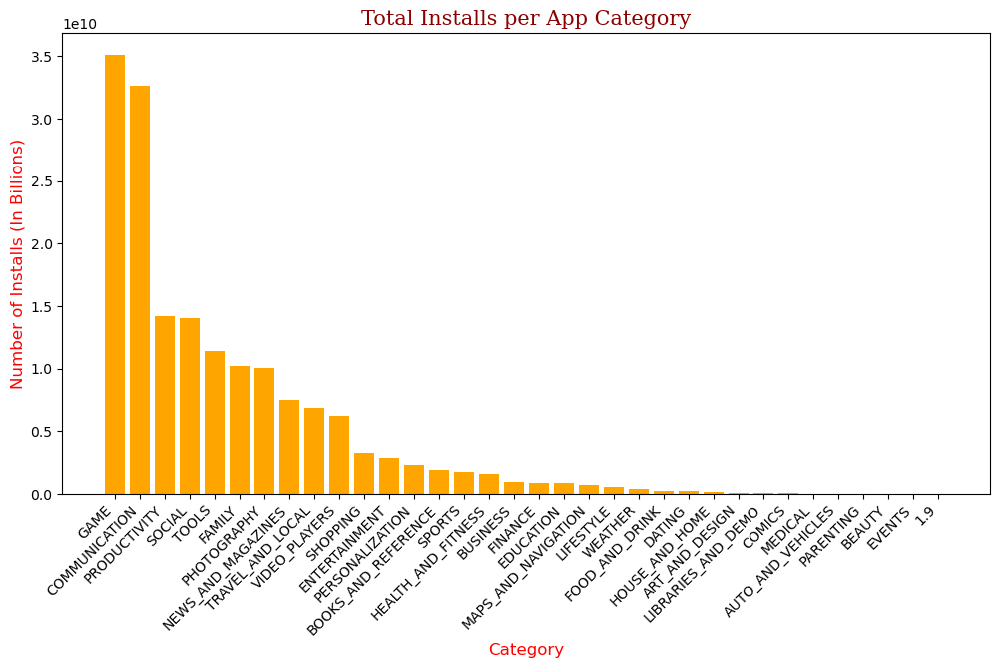
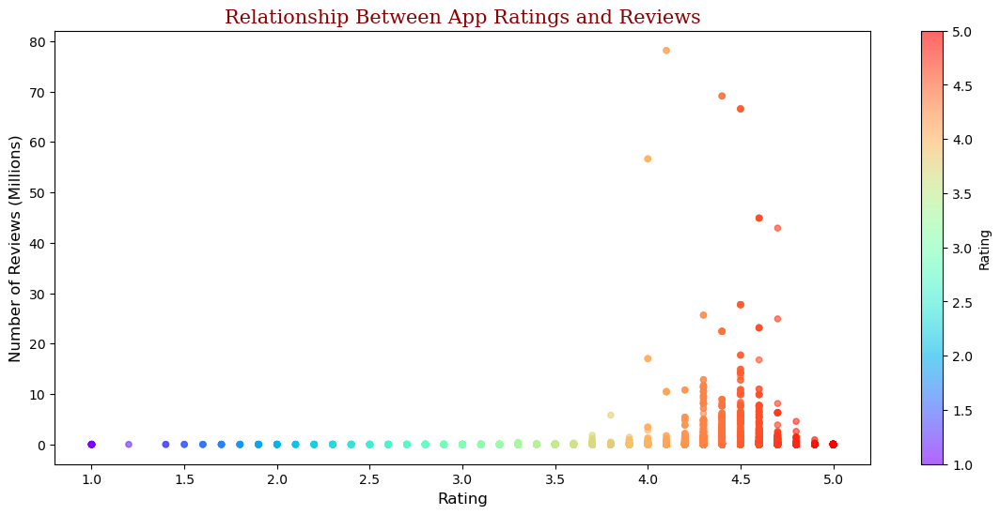
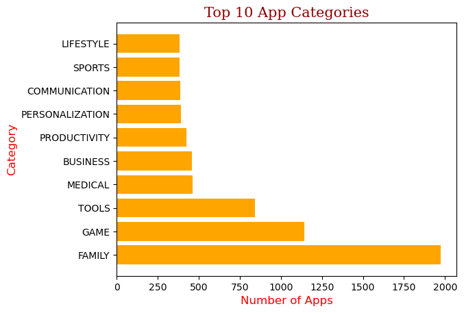

# 📊 Google Play Store Data Analysis – App Market Insights

_Exploratory analysis of Google Play Store applications to uncover trends in ratings, reviews, categories, and installs using Python._
***
## 📌 Table of Contents
- <a href="#overview">Overview</a>
- <a href="#problem-statement">Problem Statement</a>
- <a href="#dataset">Dataset</a>
- <a href="#tools--technologies">Tools & Technologies</a>
- <a href="#project-structure">Project Structure</a>
- <a href="#data-cleaning--preparation">Data Cleaning & Preparation</a>
- <a href="#exploratory-data-analysis-eda">Exploratory Data Analysis (EDA)</a>
- <a href="#key-insights--findings">Key Insights & Findings</a>
- <a href="#visualizations">Visualizations</a>
- <a href="#how-to-run-this-project">How to Run This Project</a>
- <a href="#conclusion">Conclusion</a>
- <a href="#author--contact">Author & Contact</a>
***
<h2><a class="anchor" id="overview"></a>Overview</h2>

This project performs an exploratory data analysis (EDA) on the Google Play Store dataset to uncover insights about app ratings, reviews, installs, and categories. The analysis pipeline uses Python for data cleaning, manipulation, and visualization, helping to identify trends and patterns in app performance.
***
<h2><a class="anchor" id="problem-statement"></a>Problem Statement</h2>

This project aims to answer the following questions about Google Play Store apps:
- Which app categories have the most apps?
- What is the relationship between app ratings and user reviews?
- Which apps have the highest number of installs?
- How do ratings vary across categories?
- Which factors contribute to an app's popularity?
***
<h2><a class="anchor" id="dataset"></a>Dataset</h2>

- Google Play Store CSV dataset located in `/data/` folder
- Contains app metadata such as `App Name`, `Category`, `Rating`, `Reviews`, `Size`, `Installs`, `Type`, `Price`, and `Content Rating`
- Dataset cleaned and processed using Python before analysis
***
<h2><a class="anchor" id="tools--technologies"></a>Tools & Technologies</h2>

- Python (Pandas, NumPy, Matplotlib, Jupyter Notebook)
- GitHub 
***
<h2><a class="anchor" id="project-structure"></a>Project Structure</h2>

```
google-play-store-eda/
│
├── README.md
├── .gitignore
├── requirements.txt
│
├── notebooks/                # Jupyter notebooks for analysis
│ └── playstore_eda.ipynb
│
├── data/ # Dataset CSV files
│ └── googleplaystore.csv
│
├── images/                    # Plots and visualizations
│ ├── distribution_app_ratings.png
│ ├── highest_installs.png
│ ├── relation_between_ratings_reviews.png
│ └── top_10_categories.png
│
├── reports/                    # Final analysis report
│ └── play_store_analysis_report.pdf
```
***
<h2><a class="anchor" id="data-cleaning--preparation"></a>Data Cleaning & Preparation</h2>

- Removed duplicates and irrelevant entries
- Handled missing or null values in `Rating`, `Reviews`, `Installs`, and `Price`
- Converted columns to correct data types:
  - `Reviews` and `Installs` → numeric
  - `Price` → float
- Cleaned special characters in `Installs` and `Size` columns
- Standardized categorical columns like `Category` and `Content Rating`
- Created summary tables for category-level metrics

***
<h2><a class="anchor" id="exploratory-data-analysis-eda"></a>Exploratory Data Analysis (EDA)</h2>

**Rating & Review Analysis:**
- Apps mostly rated between 4.0 – 4.5
- Some apps with zero or missing ratings
- Positive correlation between `Reviews` and `Rating`

**Install Analysis:**
- Highest installs observed in `SOCIAL` and `GAME` categories
- Many apps have very low installs (long-tail distribution)

**Category Insights:**
- Top categories by number of apps: `FAMILY`, `GAME`, `TOOLS`
- Some categories underrepresented in dataset

**Price & Type Analysis:**
- Free apps dominate the market (~95%)
- Paid apps mostly priced under $10
- No strong correlation between `Price` and `Rating`

**Outliers Identified:**
- Apps with extremely high `Reviews` or `Installs`
- Apps with 0 rating or missing `Size`
***
<h2><a class="anchor" id="key-insights--findings"></a>Key Insights & Findings</h2>

1. **Top Categories by Number of Apps**: `FAMILY`, `GAME`, and `TOOLS` dominate the Play Store, indicating app development trends.  
2. **High Rating Apps**: Majority of apps (~75%) have ratings between 4.0 and 4.5, highlighting user satisfaction patterns.  
3. **Reviews vs Ratings**: Apps with higher reviews generally have higher ratings, showing correlation between engagement and popularity.  
4. **Install Distribution**: Most apps have low installs, while a few apps dominate downloads, reflecting a long-tail distribution.  
5. **Free vs Paid Apps**:
   - Free apps: ~95% of total apps  
   - Paid apps: mostly priced under $10, indicating pricing strategy trends
***
<h2><a class="anchor" id="visualizations"></a>Visualizations</h2>

- Key visualizations generated from EDA:
  - Distribution of App Ratings
  - Top 10 App Categories by number of apps
  - Relationship between Ratings and Reviews
  - Apps with Highest Installs





***
<h2><a class="anchor" id="how-to-run-this-project"></a>How to Run This Project</h2>

1. Clone the repository:
```bash
git clone https://github.com/RajatKumarBal779/google-play-store-data-analysis-python.git
```
2. Navigate to the project folder:
```
cd play-store-eda
```
3. Install required Python libraries:
```
pip install -r requirements.txt
```
4. Open the Jupyter notebook for analysis:
   - `notebooks/playstore_eda.ipynb`
***
<h2><a class="anchor" id="conclusion"></a>Conclusion</h2>

- Focus on developing apps in top-performing categories like `FAMILY`, `GAME`, and `TOOLS` to capture high user interest  
- Encourage user engagement to improve ratings and reviews for apps with moderate installs  
- Optimize pricing strategies for paid apps to increase adoption  
- Monitor apps with extremely high installs or reviews for trends and marketing opportunities  
- Address apps with low ratings or missing data to improve overall app quality and user satisfaction
***
<h2><a class="anchor" id="author--contact"></a>Author & Contact</h2>
<strong>Rajat Kumar Bal</strong><br>
📧 Email: rajatkumarbal961@gmail.com<br>
🔗 <a href="https://www.linkedin.com/in/rajat-kumar-bal">LinkedIn</a>


